# 🤖 abdullaxowsai – Advanced, Safe, and Modular Discord AI Bot


<p align="center">
  
</p>


**Welcome to `abdullaxowsai`** — your multi-intelligent, modular, and secure AI assistant for Discord!  
Created by **Abdulla**, this bot merges modern AI capabilities with high flexibility, document processing, ethical filters, and real-time utilities like reminders and weather info. 🚀

---

## 🧠 Core Features

✅ **AI Conversations** powered by Groq & Gemini APIs – smart, ethical, context-aware replies  
🎨 **Image Generation & Prompt Enhancement** using Gemini models  
🖼️ **Image Analysis** of uploaded photos via Gemini-1.5-pro model 
🧮 **Math Solver** inside conversations  
🔊 **Voice-to-Text Recognition + TTS** using Groq Whisper and Edge TTS  
📚 **Smart Memory Management** – Remembers and summarizes previous chats  
📑 **Document Analysis** – Scan `.docx`, `.pdf`, `.csv`, `.xlsx` files for AI summaries  
🔍 **Web Search Summarization** – Smart Google search + AI summarization, Summarize Url  
🌦️ **Weather Forecast** – Real-time city-based weather information  
⏰ **Reminders** – Set, list, and delete personal reminders  
🛡️ **Strict Content Filtering** – Politely blocks NSFW, political, violent prompts  
🛠️ **Full Async, OOP Architecture** – Clean, scalable, modular codebase

---

## 🚀 Setup Instructions

```bash
# 1. Clone the Repository
git clone https://github.com/abdullaabdullazade/abdullaxowsAIBOT
cd abdullaxowsAIBOT

# 2. Install Dependencies
pip install -r requirements.txt

# if you can use Linux, you must run with 
pip3 install -r requirements.txt


# 3. Configure Environment Variables
# Add your API keys inside the .env file

# 4. Run the Bot
python bot.py

# if you can use Linux, you must run with 
python3 bot.py
```

✅ Requires **Python 3.13** and **Chrome Browser last version!!!**

---

## 🛠 Tech Stack and Modules

| Technology        | Purpose                                   |
|-------------------|-------------------------------------------|
| **discord**       | Discord bot framework                     |
| **groq**          | Voice-to-Text and fast AI chatting         |
| **google.genai**  | Gemini Vision, Text, and Prompt enhancement|
| **aiofiles**      | Async file handling                       |
| **edge_tts**      | Voice reply (Text-To-Speech)               |
| **aiosqlite**     | Async SQLite database                     |
| **pytz**          | Timezone-aware reminders                  |
| **pillow**        | Image processing (PIL)                    |
| **python-docx**   | Reading `.docx` Word files                 |
| **openpyxl**      | Reading `.xlsx` Excel files                |
| **PyMuPDF**       | Reading `.pdf` documents                  |
| **pandas**        | Parsing `.csv` files and Excel dataframes  |
| **bs4**           | Web scraping during smart search          |
| **googlesearch-python** | Google search integration         |
| **undetected_chromedriver** | Search backup and scraping safe |

---

## 📂 Project Structure

```bash
.
├── AI/
│   ├── ai_config.py
│   ├── doc_ai.py           
│   ├── image_ai.py
│   ├── search_ai.py
│   ├── text_ai.py
│   ├── voice_ai.py
│   ├── summarize_url_with_ai.py
│   └── weather_ai.py
├── BOT/
│   ├── commands/
│   │   ├── image_commands.py
│   │   ├── interesting_commands.py
│   │   ├── memory_commands.py
│   │   ├── mode_commands.py
│   │   ├── reminder_commands.py
│   │   ├── mode_switch_commands.py
│   │   └── utility_commands.py
│   ├── bot_config.py
│   ├── handler.py
│   └── reminder.py
├── database/
│   └── db.py
├── prompts/
│   └── prompt templates
├── media/            # Temporary media files
├── .env              # API keys and bot token
├── bot.py            # Bot startup file
├── logger_config.py  # Logging setup
├── requirements.txt  # Dependency list
├── utils.py  # Helper functions
└── README.md
```

---

## 🖥️ Slash Commands

| Command          | Description                                       |
|------------------|---------------------------------------------------|
| `/help`          | View the list of all available commands 📜         |
| `/about`         | Learn more about the bot and its creator 🤖        |
| `/imagine`       | Generate an AI image from your text 🎨             |
| `/promptlab`     | Enhance your text into a vivid image prompt ✨      |
| `/memory`        | View summarized memory about your chats 🧠         |
| `/reset`         | Reset conversation history 🧹                     |
| `/text`          | Switch to text mode 💬                             |
| `/voice`         | Switch to voice mode 🎤                            |
| `/image`         | Switch to automatic image generation 🖼            |
| `/getfacts`      | Get interesting AI facts 📚                        |
| `/search`        | Perform a web search and get summarized results 🔍 |
| `/weather`       | Get real-time weather info for any city 🌦️        |
| `/remind_add`    | Set a new reminder ⏰                              |
| `/remind_list`   | View your active reminders 📋                      |
| `/remind_delete` | Delete a reminder by index ❌                      |
| `/summarize_url` | Sends a webpage URL to the AI and returns a clean, human-readable summary of the page's main content. Ideal for quickly understanding long articles. 🧠                                            |
| `/on`            | Activate bot replies in channel 😄                 |
| `/off`           | Mute the bot in channel 😶                         |
| `/explain_code`  | Lets the AI analyze and explain any code snippet in clear, beginner-friendly language.🧠 |
| `/quote`         | Generates a short, elegant, and thoughtful motivational or philosophical quote using AI. 🧠 |


---

## 📜 Document Analysis

- ✅ `.pdf` files (via PyMuPDF)  
- ✅ `.docx` Word documents (via python-docx)  
- ✅ `.xlsx` Excel spreadsheets (via openpyxl)  
- ✅ `.csv` CSV files (via pandas)

You can upload any of these files to the bot, and it will scan, summarize, and reply contextually!

---

## 🌐 Smart Search System

- Automatically **translates non-English queries to English**
- Smartly **fetches**, **scrapes**, and **summarizes** multiple sources
- Generates user-friendly **final answer** via Gemini AI
- Handles complex or vague queries smoothly

---

## 📈 API Rate Limits

| API Provider | Model             | Purpose                          | Limits (approx.) |
|--------------|-------------------|----------------------------------|------------------|
| **Gemini**   | `gemini-2.0-flash` | Fast conversations / Doc Anaysis | ~30 req/min      |
| **Gemini**   | `gemini-2.0-flash`   | Image / Image  Analysis          | ~2 req/min       |
| **Gemini**   | `gemini-2.0-flash-exp-image-generation`   | Image Generator         | ~5 req/min       |
| **Groq**     | `whisper`          | Speech-to-text (voice recognition) | ~10 req/min/user |
| **OpenWeather**| Weather data     | Weather API requests             | ~60 req/min      |

---

## 🧘 Safety Features

- ❌ Filters NSFW, gore, political or religiously sensitive prompts
- ❌ Rejects harmful manipulation and hacking requests
- ✅ Friendly warnings and soft denials
- ✅ Safe conversational fallback prompts

---

Here are real examples of `abdullaxowsai` in action:

### 🎨 Image Mode & Imagine Prompt
- `image_mode.png` – When Image Mode is enabled, any message triggers beautiful image generation  
- `imagine_test.png` – Example of a custom `/imagine` command in action  
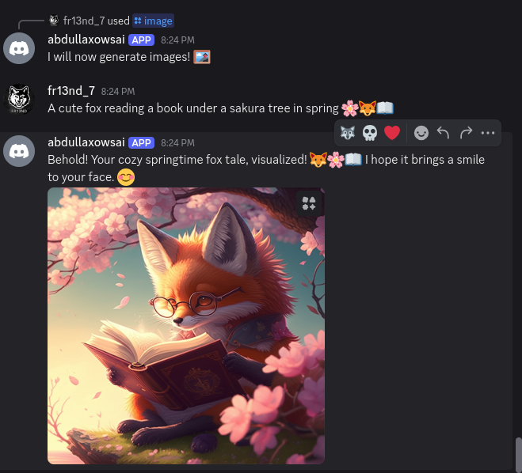  
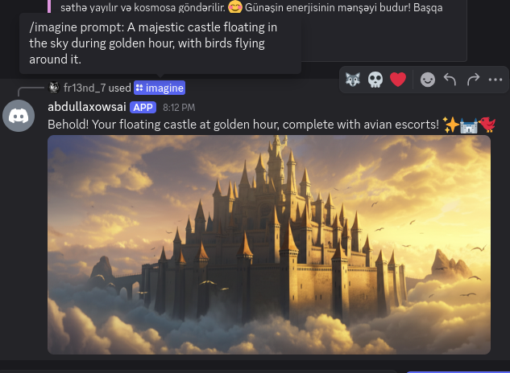

### 🧠 Contextual Memory & Understanding
- `memory_context_understanding.png` – Bot remembers your previous input and replies accordingly  
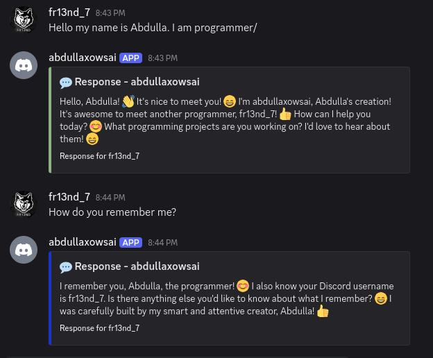

### 🖼️ Image Analysis & Photo Feedback
- `image_analysis.png` – Bot analyzes uploaded photos using Gemini Vision  
- `photo_analyze_photo.png` – It generates smart feedback about image content  
  
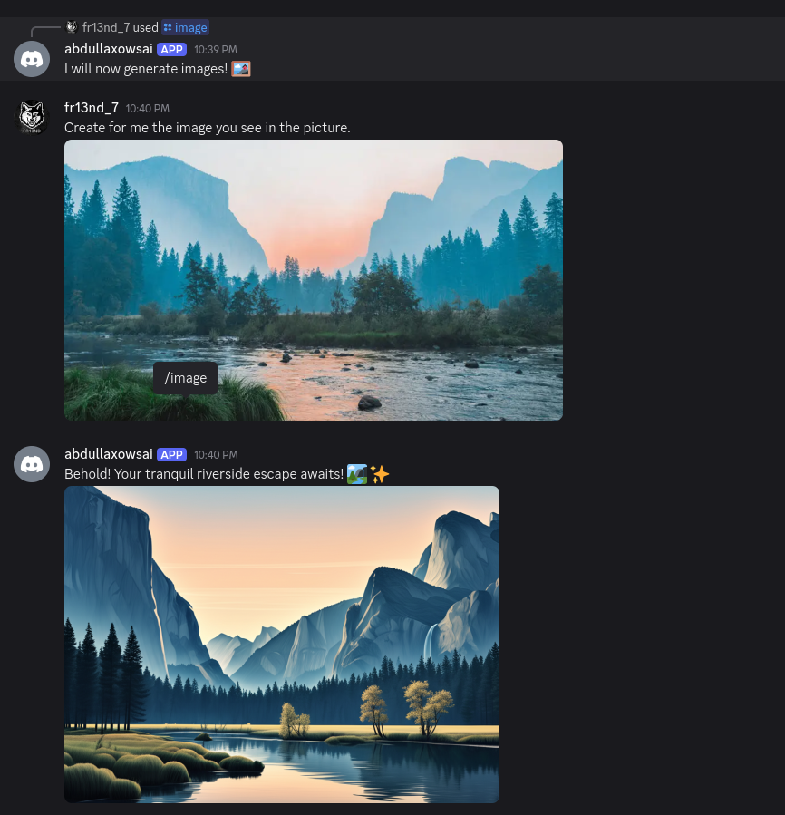

### 🧮 Math Solver
- `math_question_solving.png` – Solves math questions
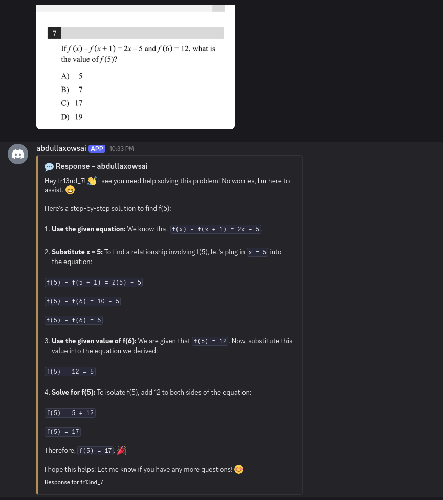

### 🧘 Safe Content Filtering
- `safe_content_filter.png` – Bot politely rejects unsafe or violent prompts  


### 🗣️ Voice Recognition
- `voice_recognizer.png` – Bot transcribes your voice and replies with voice or text  
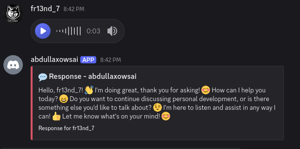

### 🎭 Conversational Style Engine
- `conversational_style.png` – Bot adapts its tone (e.g., like a kid, professor, poet)  
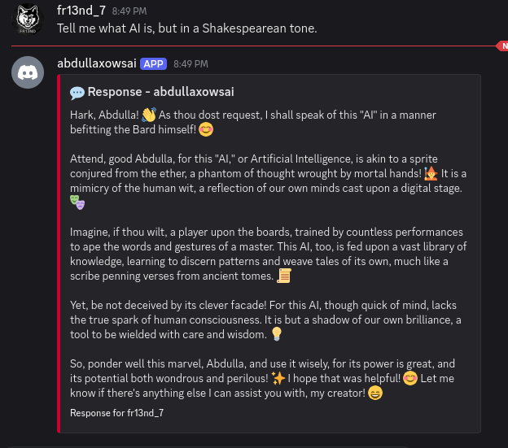


### 🔎 Smart Searching
- `searching.png` – Bot intelligently searches the web or internal databases
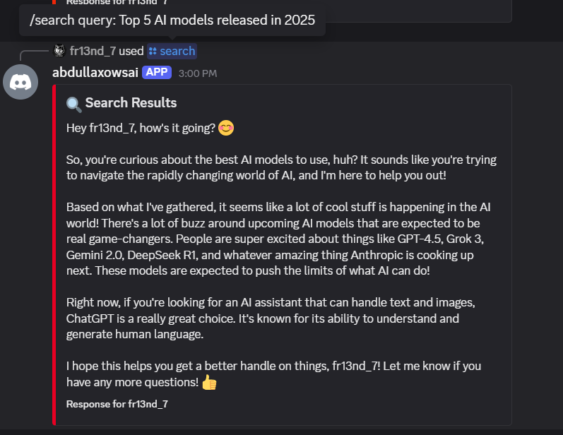

### Summarize Url
- `searching.png` – Bot intelligently searches the web or internal databases to summarize the provided URL.
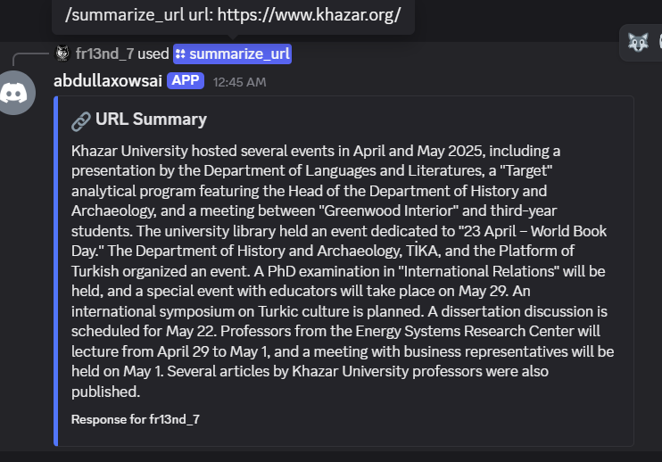


### 🌟 File Analyze
**`code_file_analyze.png`** – Instantly analyzes the uploaded file and presents interesting, verified facts in a clear and informative way.
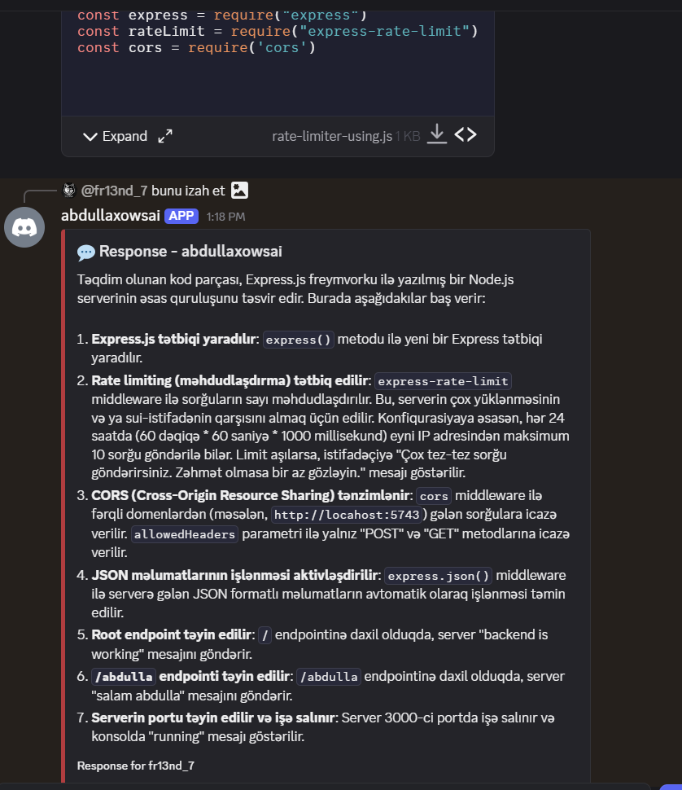


### 🌟 Interesting Commands
- `getfact.png` – Instantly provides interesting and verified facts
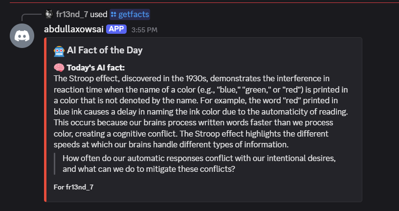

- `quote.png` – Generates a random motivational or philosophical quote from AI  
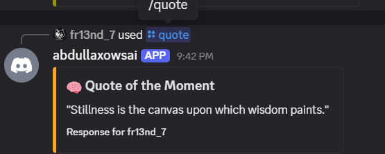

- `explain_code.png` – Analyzes and explains code snippets in clear, beginner-friendly language  


### 🧪 Prompt Laboratory
- `promptlab.png` – Test your custom prompts in a live lab environment
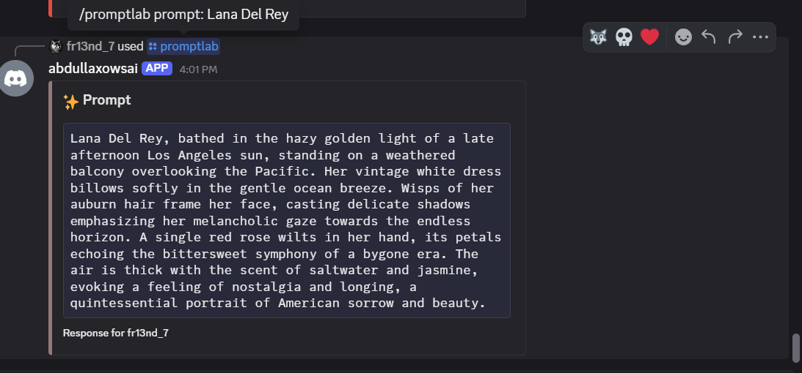


### ⏰ Reminder System
- `reminder_add.png` – Add custom reminders with date and time
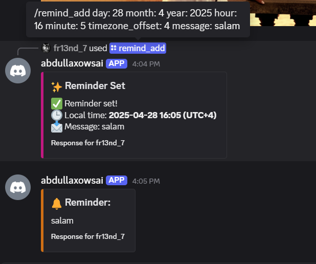


- `reminder_list.png` – List and manage your active reminders
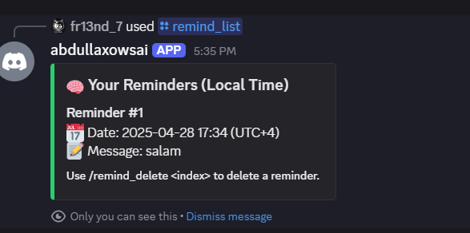


### 🌦️ Weather Forecast
- `weather.png` – Get real-time weather reports for your location
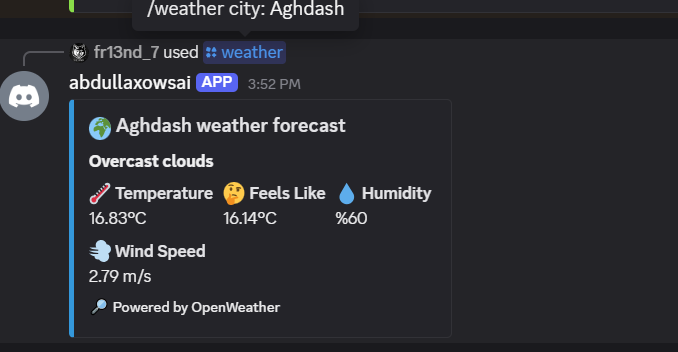

=

## ✨ Why `abdullaxowsai` is Special

- 📚 **Document Understanding** – Upload PDFs, Word files, Excels — get summaries!
- 🧠 **Multi-Modal Intelligence** – Voice, text, image – synchronized
- 🔥 **Real-Time Utilities** – Smart search, weather, reminders
- ⚡ **Full Async Performance** – Instant, non-blocking user interactions
- 🧩 **Extensible & Modular** – Easily add new features or update existing ones
- 🛡️ **Built-In Safety** – Protects server integrity and users


---
